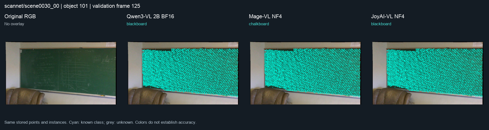
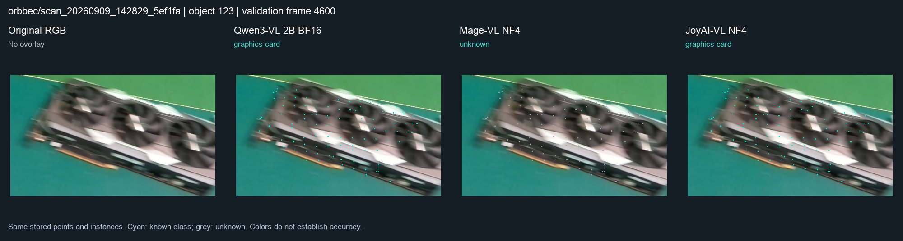

# SGF-SGAligner

`developnew`：RGB-D 建图、SAM3 语义/实例融合、未知物体恢复与可切换 VLM 命名。2026-09-15 整合版本保留几何基线，采用经过开发场景验证的 **T1 实例关联 + P2 多视角补全 + Qwen3-VL-2B 确认命名**，并保留其他所有已测试模型的接口。

[使用方法与算法边界](docs/experiments/semantic-runtime-20260915/README.md) · [模型注册表](configs/vlm_models.json) · [本次代码验证](docs/experiments/semantic-runtime-20260915/VALIDATION.md) · [原 SGF/SGA 入口](docs/SEMANTIC_MAPPING.md)

## 2026-09-16：优质视角与未知点语义优化

新增 `refine-semantic`：在已有地图/估计轨迹上选择物体视角，真实运行 Qwen NF4 与 SAM3，再用多帧深度证据填充未知点。ScanNet0050全GT正确标注率33.20%→33.40%，0011为40.70%→41.26%，0030不变；可选 `--fragments` 在Orbbec给收纳盒和塑料袋补244点（无完整GT）。几何、已有实例ID和已知标签保留；实例IoU50数量没有增加。

这部分是固定几何的显式后处理入口，不自动改变原串行/并行流程。每五帧默认、所有模型/API接口均保留；未采用出现退步的运动取帧、表面扩张或已知类别重写。

```bash
PYTHONPATH=src python -m pose_pipeline.semantic_runtime refine-semantic \
  --workspace /absolute/path/prepared-refinement --stage all
# 经开发场景验证的可选三视角未知碎片策略：另加 --fragments
```

[准备输入、RGB-D注册、完整参数与真实结果](docs/experiments/semantic-refinement-20260916/README.md) · [代码集成验证](docs/experiments/semantic-refinement-20260916/VALIDATION.md)

## RTX 4060：分开运行与阶段并行的推荐

2026-09-15 最新复测：**分开运行优先 Qwen3-VL-2B BF16；阶段并行优先 Qwen3-VL-2B NF4**。这是按验证完整性、命名质量和显存取舍的推荐，不是跨场景最优准确率结论。最新代码已修复 Mage 只编码文字、漏传图像的问题，并保留 DeepSeek 官方 API 和 Qwen 图像预算实验配置。

| 模式 | 推荐参数 | 依据 |
|---|---|---|
| 完全分开 | `--schedule serial --vlm qwen3vl_2b_bf16 --stride 5` | 有同输入串行对照和完整冻结地图收益验证；8GB 显存可容纳分阶段工作 |
| 阶段并行 | `--schedule parallel --vlm qwen3vl_2b_nf4 --stride 5` | 两场原始 120 帧均完成，VLM 阶段峰值约 2638 MiB；固定命名评分 14/18 |

若更重视显存，两种模式均可显式选择 NF4；但本轮没有 NF4 串行配对和 NF4 的 T1/P2 最终地图验收，不能套用 BF16 的速度或地图指标。CLI 的兼容默认仍为 `parallel + BF16`，下方命令显式选择推荐配置。Gemma E2B Q4（280 图像 tokens）保留作备用，没有证明整体优于 Qwen。

| 参数 | 分开 BF16 | 并行 NF4 |
|---|---|---|
| 几何输入 | manifest 全部 RGB-D 帧 | 相同 |
| SAM3 | stride=5，另含最后一帧；threshold=0.5 | 相同 |
| CPU | runtime 顶层 `threads=2`；模型内 `threads=4` | 相同 |
| 超时 | runtime `stage_timeout=7200` 秒，长序列按需要增大 | 相同 |
| Qwen 图像预算 | `min_pixels=3136, max_pixels=150528` | 相同 |
| 生成 | `max_new_tokens=24, do_sample=False, use_cache=True` | 相同 |
| 量化/计算 | BF16 | NF4、BF16 compute、double quant 开 |
| 注意力/种子/batch | SDPA / 42 / 每次一张裁剪 | 相同 |
| 2D→3D 深度门槛 | 0.05 m | 相同 |
| 名称归属/投票 | ≥30 支持点、实例占比≥0.65、≥2 不同帧同名且严格胜出 | 相同 |

模型量化、图像预算和生成参数来自注册表；runtime 只填主机路径及支持的运行选项，不要在其中添加不会生效的 IoU/min_pixels 字段。**所有固定融合参数、裁剪规则、Gemma 配置及环境路径要求**见 [4060 完整参数说明](docs/experiments/rtx4060-models-20260915/README.md#参数完整设置)。

```bash
# 先复制 configs/semantic_runtime.example.json，填好实际环境和权重路径。
# 分开运行：
PYTHONPATH=src python -m pose_pipeline.semantic_runtime run-sam3 \
  --manifest /absolute/path/rgbd-manifest.json --runtime /absolute/path/runtime.json \
  --output /absolute/path/new-serial-bf16 \
  --schedule serial --vlm qwen3vl_2b_bf16 --stride 5

# 阶段并行：
PYTHONPATH=src python -m pose_pipeline.semantic_runtime run-sam3 \
  --manifest /absolute/path/rgbd-manifest.json --runtime /absolute/path/runtime.json \
  --output /absolute/path/new-parallel-nf4 \
  --schedule parallel --vlm qwen3vl_2b_nf4 --stride 5
```

“阶段并行”是 GPU 模型加载与 CPU 融合重叠；SAM3 退出释放显存后才加载 Qwen，**不是两个 GPU 模型同时常驻**。本轮测得的主要重叠发生在加载阶段，不能承诺推理并发。

| 最新同输入短窗实测 | ScanNet0030 秒 / FPS | Orbbec 秒 / FPS |
|---|---:|---:|
| BF16 serial | 107.85 / 1.113 | 102.20 / 1.174 |
| BF16 parallel | 101.67 / 1.180 | 99.76 / 1.203 |
| NF4 parallel | 103.48 / 1.160 | 101.19 / 1.186 |

每组 120 原始帧、25 SAM3 帧，仅一次运行；计入加载、新轨迹、新几何、语义融合和导出。NF4 整条 pipeline 峰值约 6352 MiB，SAM3 仍占峰值；不是只有 2638 MiB。共 42 次执行、40 个有效结果（旧 Mage 两组漏图像，已保留并以修复后两组替换比较）。不含 T1/P2 上游证据生成，不能当作完整长序列实时 FPS。

同一批 288 张裁剪、ScanNet0030 固定 18 个开发对象的 N2 命名正确数：**Qwen NF4 14、BF16 11、Mage 10、DeepSeek 9、Gemma 7、JoyAI 6**。这不是地图 mIoU；其他场景尚无本轮对应 GT 排名，Orbbec 命名更多也不等于更准确。下文完整地图的 23/82 仍属于 BF16，不能转给 NF4。

[全部模型与分场景结果](docs/experiments/rtx4060-models-20260915/README.md#真实结果与结论边界) · [参数消融记录](docs/experiments/rtx4060-models-20260915/PARAMETER_RUNS.json) · [DeepSeek 使用方法](docs/experiments/rtx4060-models-20260915/README.md#保留的-api-接口) · [本次代码回归](docs/experiments/rtx4060-models-20260915/VALIDATION.md)

## 使用开关

```bash
# 在所选模型的 Python 环境中单独测试图片。
PYTHONPATH=src python -m pose_pipeline.semantic_runtime test-vlm \
  --model qwen3vl_2b_bf16 --runtime /absolute/path/runtime.json \
  --images /absolute/path/object.png --output /absolute/path/new-test

# 重新处理原始 RGB-D：串行 serial / 阶段并行 parallel。
PYTHONPATH=src python -m pose_pipeline.semantic_runtime run-sam3 \
  --manifest /absolute/path/rgbd-manifest.json \
  --runtime /absolute/path/runtime.json --output /absolute/path/new-run \
  --schedule parallel --vlm qwen3vl_2b_bf16 --stride 5

# 重放完整场景已经生成的真实预测，应用 T1/P2 与确认命名。
PYTHONPATH=src python -m pose_pipeline.semantic_runtime enhance-semantic \
  --bundle /absolute/path/BUNDLE.json --output /absolute/path/new-enhanced-map \
  --surface verified --vlm qwen3vl_2b_bf16
```

`--vlm none` 可关闭小模型。`--schedule serial` 完全按阶段依次执行；默认 `parallel` 允许 GPU 工作阶段与 CPU 融合重叠（本轮主要来自模型加载），同一时刻不驻留两个本地 GPU 大模型。模型列表使用 `list-vlm-models` 查询。配置示例在 [semantic_runtime.example.json](configs/semantic_runtime.example.json)。路径示例必须换成实际文件，权重和运行环境不随仓库分发。

**两条路径的输出不同：** `run-sam3` 新建轨迹与地图，VLM 名称写入 `instance_names.json`；`enhance-semantic` 使用已有预测证据，确认后给未知实例写入真正的 `semantic_id`。完整 T1/P2 的上游证据生成尚未串入第一条命令。[输出文件和 bundle 构建说明](docs/experiments/semantic-runtime-20260915/README.md)。

## 地图效果：采用哪些改进

| 对照 | 结果 | 结论 |
|---|---|---|
| ScanNet0030：T1 → P2 | 黑板点集 IoU **32.01% → 79.98%**；补入 6,103 个原先未归属点；82 对象中类别无关 IoU50 命中 **23 → 24** | 采用经过双提示、多视角验证的补全 |
| ScanNet0030：P2 无 VLM → P2 + Qwen | 类别正确且 IoU ≥ 0.5 的对象 **22/82 → 23/82**；GT 点级类别正确比例 **58.11% → 63.22%** | 命名补齐黑板；实例几何保持不变 |
| ScanNet0050 | 确认 `piano`，3,957 个地图点；P2 未增加表面点 | 有命名收益，未声称几何变好 |
| Orbbec | 确认 `graphics card`，123 个地图点；P2 未增加表面点 | 保留命名收益，显卡几何覆盖仍不足 |
| ScanNet0011 | 无通过条件的新命名，P2 未增加表面点 | 保持原结果 |

[T1/P2 原始对照结果](docs/experiments/semantic-runtime-20260915/SURFACE_RESULTS.json)。

**口径：** 0030 的 82 对象为固定开发诊断集，过滤 wall/floor/ceiling 和少于 50 个 GT 顶点的对象，使用 5 cm 最近邻转移；点级分母为 264,339 个已标注 GT 顶点，含结构类。GT 只用于事后评价。这不是官方 ScanNet AP/mIoU，也不是此前 27 对象子集指标。语义覆盖率不能当作准确率。新增 Qwen 命名对应 13,499 个类别正确 GT 点和 51 个错误 GT 点。[完整 GT 结果](docs/experiments/semantic-runtime-20260915/MAP_GT_RESULTS.json)。

已有正语义标签、原有实例归属和 XYZ 均受到保护。新实现对四个场景的重放复现了封存结果的逐点类别名、实例和置信度；0050 的动态类别整数 ID 不同，需按各自 `classes.json` 比较。3RScan 尚未完成这套改进的完整场景验证。

## 真实效果图



ScanNet0030，未参与命名投票的验证帧 125。青色为已经命名的同一组地图点；三列几何相同，名称不同。图像来自封存实验，并非新生成的示意图。



Orbbec，验证帧 4600。Qwen/Joy 命名为显卡，Mage 保留未知；只有少量地图点，表明命名成功尚未解决表面覆盖。配色本身不证明正确率。[图片来源与哈希](docs/experiments/semantic-runtime-20260915/VISUAL_SOURCES.json)。

## 已验证完整地图的 Qwen、Mage、Joy 对照

以下为同批 288 张裁剪的独立命名测评，固定 18 个可评价对象；N2 要求至少两个不同融合视角的同名预测。单张调用耗时不含首次加载，显存是整卡采样峰值（含桌面）。

| 模型 | N2 类别正确对象 | 秒 / 裁剪 | 整卡峰值 | 0030 最终类别正确 IoU50 |
|---|---:|---:|---:|---:|
| **Qwen3-VL-2B BF16（默认）** | **11/18** | **0.087** | 5,145 MiB | **23/82** |
| Mage-VL NF4 | 10/18 | 0.171 | 4,696 MiB | 22/82 |
| JoyAI-VL NF4 | 6/18 | 0.274 | 7,359 MiB | 23/82 |

这里严格冻结词表；Mage 的 `chalkboard` 与 GT `blackboard` 不相等，部分 Joy 输出的更细类别也会扣分，不能直接等同于视觉理解失败。三者在 0030 的实例 IoU50 均为 24/82，说明更换命名模型没有改善这张地图的实例几何。Joy 在 0050 额外命名一个 356 点的 backpack，但没有证明综合收益超过 Qwen。保留 Mage/Joy 接口供继续测试，不替换默认。

<details>
<summary>展开全部模型结果（29 行历史测评；包含不同配置和控制重复）</summary>

N1 是单个融合视角，N2 是不同融合视角的名称一致性。每行有 288 次真实裁剪调用，18 个可评价对象。不同来源不是同一次实验；不得据此把跨机器时延拼成排行榜。ssh44 的较大模型实际运行主机为 ssh44，未能登录 ssh18。完整版本和来源见 [MODEL_RESULTS.json](docs/experiments/semantic-runtime-20260915/MODEL_RESULTS.json)。

| 模型接口 ID | 主机 | N1 / 18 | N2 / 18 | 秒 / 裁剪 | 整卡峰值 MiB | 来源 |
|---|---|---:|---:|---:|---:|---|
| `qwen35_08b_bf16` | ssh33 | 12 | 10 | 0.083 | 2954 | 小模型初测 |
| `qwen35_2b_bf16` | ssh33 | 14 | 12 | 0.136 | 5560 | 小模型初测 |
| `qwen35_4b_nf4` | ssh33 | 14 | 13 | 0.233 | 4498 | 小模型初测 |
| `qwen3vl_2b_bf16` | ssh33 | 12 | 11 | 0.088 | 5138 | 小模型初测 |
| `qwen25_3b_awq` | ssh33 | 2 | 2 | 0.239 | 4696 | 小模型初测 |
| `gemma4_e2b_qat_q4` | ssh33 | 9 | 7 | 0.116 | 3602 | 小模型初测 |
| `minicpmv46_bf16_16x` | ssh33 | 2 | 1 | 0.112 | 3790 | 小模型初测 |
| `minicpmv46_bf16_4x` | ssh33 | 4 | 4 | 0.146 | 3810 | 小模型初测 |
| `minicpmv4_nf4` | ssh33 | 4 | 2 | 0.418 | 4400 | 小模型初测 |
| `internvl35_1b_bf16` | ssh33 | 14 | 10 | 0.424 | 3634 | 小模型初测 |
| `internvl35_2b_bf16` | ssh33 | 15 | 11 | 0.617 | 6192 | 小模型初测 |
| `smolvlm2_500m_bf16` | ssh33 | 12 | 10 | 0.344 | 2764 | 小模型初测 |
| `smolvlm2_22b_bf16` | ssh33 | 13 | 11 | 0.767 | 5971 | 小模型初测 |
| `qwen25_3b_bf16_control` | ssh44 | 3 | 2 | 0.134 | 8517 | 小模型初测 |
| `qwen35_08b_nf4` | ssh33 | 13 | 9 | 0.104 | 2069 | 部署/规模测评 |
| `qwen3vl_2b_nf4` | ssh33 | 15 | 14 | 0.094 | 2565 | 部署/规模测评 |
| `qwen35_4b_nf4_detail` | ssh33 | 13 | 12 | 0.243 | 4493 | 部署/规模测评 |
| `gemma4_e2b_qat_q4_560` | ssh33 | 9 | 7 | 0.115 | 3545 | 部署/规模测评 |
| `gemma4_e2b_qat_q4_1120` | ssh33 | 9 | 7 | 0.115 | 3545 | 部署/规模测评 |
| `gemma4_e2b_qat_q4_fixed560` | ssh33 | 7 | 7 | 0.457 | 3707 | 部署/规模测评 |
| `gemma4_e2b_qat_q4_fixed1120` | ssh33 | 6 | 6 | 1.069 | 3971 | 部署/规模测评 |
| `glm53flash_api` | remote API from macOS client | 12 | 9 | 2.441 | — | 部署/规模测评 |
| `qwen3vl_2b_nf4_44` | ssh44 supplementary, not ssh18 | 15 | 14 | 0.136 | 2972 | 部署/规模测评 |
| `qwen3vl_8b_nf4_44` | ssh44 supplementary, not ssh18 | 6 | 5 | 0.224 | 7718 | 部署/规模测评 |
| `qwen35_4b_nf4_44` | ssh44 supplementary, not ssh18 | 13 | 12 | 0.332 | 4666 | 部署/规模测评 |
| `qwen35_9b_nf4_44` | ssh44 supplementary, not ssh18 | 6 | 5 | 0.386 | 9142 | 部署/规模测评 |
| `qwen3vl_2b_bf16` | ssh33 | 12 | 11 | 0.087 | 5145 | Mage/Joy 同批复测 |
| `mage_nf4` | ssh33 | 12 | 10 | 0.171 | 4696 | Mage/Joy 同批复测 |
| `joy_nf4` | ssh33 | 7 | 6 | 0.274 | 7359 | Mage/Joy 同批复测 |

MiniCPM 视觉试验使用 MiniCPM-V 4 和 V 4.6；用户提到的 MiniCPM5-2B 不是这两个视觉接口。Gemma 只提高 max-token 上限没有强制增大图片，固定 min/max 560、1120 的变体才改变实际图像预算。大模型没有在这组冻结诊断上带来稳定收益，但样本不足以做普遍模型排名。

</details>

## 历史速度及关闭小模型的影响

ssh33（RTX 4060 Laptop，8 GiB），每场 **120 个原始 RGB-D 帧、25 个 SAM3 帧**，Qwen3-VL-2B BF16。下表来自整合前的 2026-09-15 受控原型，每项两次完成运行；计入进程启动、模型加载、新几何、SAM3、融合、导出，不含下载/安装及事后审计。文件缓存可能已热。

| 场景 | 串行耗时 / FPS | 阶段并行耗时 / FPS | 整卡峰值 |
|---|---:|---:|---:|
| ScanNet0030 | 107.27 s / 1.12 | **101.13 s / 1.19** | 约 6.13 GiB |
| Orbbec | 101.76 s / 1.18 | **96.94 s / 1.24** | 约 6.12 GiB |

这是原始帧吞吐，**不能支持 30 FPS 实时处理**，也不是完整场景或含 T1/P2 的最终流程 FPS。VLM 在这一计时路径只补名称元数据。[历史计时与配对检查](docs/experiments/semantic-runtime-20260915/RAW_TIMINGS.json)。两个本地 GPU 模型同时驻留的 Qwen2B NF4 试验发生 OOM；本次开关使用阶段并行，避免这条失败路径。

另一次独立配对消融（8 次运行、每条件两次）中，关闭小模型后：0030 **1.21 → 1.34 FPS**，Orbbec **1.25 → 1.40 FPS**，总时间分别减少 10.04% 和 10.38%；整卡峰值几乎不变，因为 SAM3 占峰值。四组中的 25 帧 SAM3 数组全部一致；一组有微小几何非确定性，最近邻语义一致率 99.975%，其余逐点相同。完整冻结地图关闭命名会失去黑板、钢琴、显卡的新类别。[无 VLM 消融](docs/experiments/semantic-runtime-20260915/NO_VLM_RESULTS.json)。

## API 结果

GLM-5.3-Flash：固定对象 N2 为 **9/18**，平均 **2.44 s / 裁剪**，没有证明整体好于本地 Qwen。PaddleOCR-VL-1.6：18 张图中 5 张有非空 OCR，含队列的平均耗时 **107.65 s / 图**；加入 OCR 后 6 个对象的最终一致命名均未变化。[OCR 详细结果](docs/experiments/semantic-runtime-20260915/PADDLE_RESULTS.json)。

两种接口都保留。GLM 可选作命名器；PaddleOCR 只作为文字证据测试，不是物体分割器。凭证通过 `GLM_API_KEY` / `PADDLEOCR_API_KEY` 环境变量提供，仓库不保存密钥。只有显式选择 API 才上传所选图像。

## 复现与现有限制

本次代码验证、完整命令和失败记录见 [VALIDATION.md](docs/experiments/semantic-runtime-20260915/VALIDATION.md)。结果 JSON 和来源哈希随代码保存，原始图像、PLY、权重和完整日志保留在 `SGF-SGA/comparisons/` 实验档案。没有稳定跨场景收益的全局融合、参数扫描和进一步扩张，没有被推广为默认配置。

这些结果来自开发场景。Orbbec 没有完整 GT；3RScan 没有本轮完整流程验证；小样本得分不能证明未见场景泛化。当前仍需要提升未知物体的几何覆盖、对类别同义词做独立评价，以及把 T1/P2 的上游证据生成接入新的完整场景流程。

<details>
<summary>历史 v0.1 及早期 develop 配置说明（仅对应各自版本）</summary>

以下文字保留原始版本背景，其中“Current version”“scope exclusions”等描述只适用于历史 v0.1，不代表上面的 developnew 集成状态。


`developnew` current SAM3 mapping profile: [SAM3 every 5 frames, validation and run entry](docs/experiments/sam3-stride5-20260913/README.md).
This adopts the coverage-first offline semantic replay from the ScanNet/Orbbec
sampling experiments. It preserves frozen geometry and exports semantic/instance
labels; the guide records accuracy tradeoffs and the incomplete 3RScan validation.
The existing `run-rgbd` / `run-semantic` commands retain their original entry points.

`developnew` experimental entry: [SGF / SGA semantic and instance mapping](docs/SEMANTIC_MAPPING.md).
Run `run-rgbd` for the complete trajectory and RGB geometry, then `run-semantic`
to replay SGF with those poses, associate objects with SGA, consolidate supported
same-part fragments, and export integer semantic/instance labels on the original
map. Current validation and remaining label-quality limitations are documented
in the linked guide; this is an experimental integration.

New develop profile: [depth-first RGB-D loop recovery and full-frame validation](docs/depth_first_pipeline_zh.md).
Use `configs/pose/unified_backend_depth_first.yaml` with `run-unified`. Four public-entry runs adopted improved final outputs in three scenes and retained the original DPV result in one; scene0030_00's major double-table ghost is removed in the adopted full refusion. This remains development-only; the guide separates candidate gains, final results, and remaining accuracy limits.

Earlier integration reports (historical configurations and results):

Development integration: [Hybrid36 + RGB-D PnP + bounded Huber + full-frame Guard](docs/unified_pose_backend_zh.md).
Run it explicitly with `python -m pose_pipeline run-unified`; the guide includes the tested configuration, artifacts, and accuracy limitations.

Follow-up experiments: [controlled scaling ablation, registration recovery, and geometry audit](docs/unified_pose_followup_zh.md).
Optional profiles improve some candidate metrics; all four final results still roll back to DPV. The original profile remains unchanged.

CPU-only follow-up: [local geometric ICP, overlap ROI, colored ICP, and directional weights](docs/lightweight_rgbd_trials_zh.md).
The 24-run ablation adds no ColorPCR/PointDSC model; plain local ICP has the best mean candidate F-score, with remaining regressions and no promoted output.


*Figure 1. Current SGF-SGAligner research pipeline. Prepared scene graphs and
local point clouds are aligned through multimodal node matching,
multi-hypothesis geometric registration and a fail-closed release gate.*

Paper-ready figure: [editable SVG](docs/assets/sgf-sgaligner-method-overview-v0.1.0.svg) ·
[vector PDF](docs/assets/sgf-sgaligner-method-overview-v0.1.0.pdf) ·
[300 dpi PNG](docs/assets/sgf-sgaligner-method-overview-v0.1.0.png)

SGF-SGAligner is a research product for scene-graph-driven multi-scan
alignment, robust point-cloud registration and safety-gated 3D fusion.

It converts prepared scene graphs and local point clouds into cross-scan object
correspondences, generates multiple geometric pose hypotheses, refines them,
and releases a fused result only when the registration decision passes explicit
safety checks.

## Current version

**`v0.1.0-research-preview`**

This version establishes the backend research pipeline and its reproducibility
contracts. It is intended for controlled experiments and integration work, not
as a production-ready raw-RGB-D application.

Source snapshot:

- Research branch: `wu/fixed4-active-v2-candidate`
- Source commit: `2bd1bbf7f280bd65edcad427fd0840e09c39f6dc`
- Product snapshot date: 2026-08-31

## What the product does

```text
prepared SGF/InSeg scene graph + local point cloud
  -> multimodal graph encoding and cross-scan node matching
  -> multi-hypothesis geometric registration
  -> GeoTransformer / RANSAC / ICP refinement
  -> fail-closed RegistrationDecision
  -> fused PLY candidate
```

Core capabilities:

- adapts SGF/InSeg graph objects, relations and point-cloud regions into a
  deterministic alignment contract;
- performs multimodal cross-scan object matching;
- generates and compares multiple rigid registration hypotheses;
- validates forward/reverse, ICP and geometric-consistency evidence;
- blocks unsafe or undeclared execution instead of releasing a questionable
  transform;
- records preregistration manifests, hashes and audit receipts for repeatable
  research evaluation.

## Validation status

The current single-node backend candidate reaches successful matching and
registration execution, and its adapter validation passes. The outer runtime
input audit still blocks final result release because a small set of lazy system
dependency reads has not yet been sealed.

That open item is an execution-packaging issue rather than a change to the
matching or registration mathematics. See
[INTEGRATION_STATUS.md](INTEGRATION_STATUS.md) for the exact evidence boundary.

Current scope exclusions:

- Pose/SLAM front end;
- raw RGB-D replay and tracking;
- production-wide batch qualification;
- bundled datasets, generated outputs and binary checkpoints.

## Experimental SG-PGM-inspired matching

Three inference-only matching extensions are available behind explicit flags:

- Sinkhorn partial one-to-one node assignment with a development-calibrated
  correspondence budget;
- `P2SG-lite` rigid-invariant object geometry fused with graph similarity;
- scene-graph-guided global re-ranking of GeoTransformer point
  correspondences.

They are **disabled by default** and do not change the historical official
top-3 path. Enable the combined research preset with
`--sgpgm-experimental-preset`, or control the three arms independently with
`--matching-policy`, `--geometry-fusion-alpha`, and
`--graph-rescore-beta`. The combined preset improved held-out node matching in
the shadow ablation, but did not pass the first end-to-end Fixed4 registration
gate; it remains an experimental candidate and rejected results stay
fail-closed. See
[docs/SGPGM_INSPIRED_MATCHING.md](docs/SGPGM_INSPIRED_MATCHING.md).

## Repository layout

```text
configs/        experiment and dataset configuration
docs/           protocols, audits and research notes
manifests/      preregistration and execution manifests
preprocessing/  graph and scan preparation utilities
scripts/        training, evaluation and sealed-execution entry points
src/adapters/   SGF/InSeg input adapters
src/aligner/    multimodal graph-alignment model
src/matching/   opt-in node/point matching extensions
src/safety/     registration decisions and fail-closed contracts
tests/          unit, integration and security tests
```

## Get the source

```bash
git clone --recurse-submodules https://github.com/Aidenwu0209/SGF-SGAligner.git
cd SGF-SGAligner
git checkout v0.1.0-research-preview
```

Datasets, experimental outputs, credentials and checkpoint binaries are not
stored in this repository. Checkpoint provenance is represented by hashes and
must be resolved through the documented download process.

Some historical research scripts retain source-machine defaults for exact
reproduction. Prefer command-line/config overrides and review those defaults
before running on another host.

## Research roadmap

1. Close the remaining runtime-input audit without broad filesystem
   whitelisting.
2. Qualify selection, calibration and fixed-set backend gates.
3. Validate batch reconstruction and fused PLY consistency.
4. Integrate Pose/SLAM and raw RGB-D only after the backend is sealed.

## Open-source foundations

This research product builds on open-source scene-graph alignment and geometric
registration components. Original attribution, paper links and setup notes are
preserved in
[docs/UPSTREAM_SGALIGNER_README.md](docs/UPSTREAM_SGALIGNER_README.md). The
GeoTransformer dependency is pinned as a submodule for reproducibility.

## License

MIT. See [LICENSE](LICENSE). Third-party components remain subject to their own
licenses.

</details>
