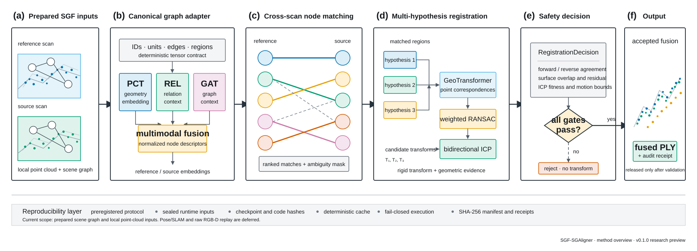

# SGF-SGAligner




*Figure 1. Current SGF-SGAligner research pipeline. Prepared scene graphs and
local point clouds are aligned through multimodal node matching,
multi-hypothesis geometric registration and a fail-closed release gate.*

Paper-ready figure: [editable SVG](docs/assets/sgf-sgaligner-method-overview-v0.1.0.svg) ·
[vector PDF](docs/assets/sgf-sgaligner-method-overview-v0.1.0.pdf) ·
[300 dpi PNG](docs/assets/sgf-sgaligner-method-overview-v0.1.0.png)

SGF-SGAligner is a research product for scene-graph-driven multi-scan
alignment, robust point-cloud registration and safety-gated 3D fusion.

It converts prepared scene graphs and local point clouds into cross-scan object
correspondences, generates multiple geometric pose hypotheses, refines them,
and releases a fused result only when the registration decision passes explicit
safety checks.

## Current version

**`v0.1.0-research-preview`**

This version establishes the backend research pipeline and its reproducibility
contracts. It is intended for controlled experiments and integration work, not
as a production-ready raw-RGB-D application.

Source snapshot:

- Research branch: `wu/fixed4-active-v2-candidate`
- Source commit: `2bd1bbf7f280bd65edcad427fd0840e09c39f6dc`
- Product snapshot date: 2026-08-31

## What the product does

```text
prepared SGF/InSeg scene graph + local point cloud
  -> multimodal graph encoding and cross-scan node matching
  -> multi-hypothesis geometric registration
  -> GeoTransformer / RANSAC / ICP refinement
  -> fail-closed RegistrationDecision
  -> fused PLY candidate
```

Core capabilities:

- adapts SGF/InSeg graph objects, relations and point-cloud regions into a
  deterministic alignment contract;
- performs multimodal cross-scan object matching;
- generates and compares multiple rigid registration hypotheses;
- validates forward/reverse, ICP and geometric-consistency evidence;
- blocks unsafe or undeclared execution instead of releasing a questionable
  transform;
- records preregistration manifests, hashes and audit receipts for repeatable
  research evaluation.

## Validation status

The current single-node backend candidate reaches successful matching and
registration execution, and its adapter validation passes. The outer runtime
input audit still blocks final result release because a small set of lazy system
dependency reads has not yet been sealed.

That open item is an execution-packaging issue rather than a change to the
matching or registration mathematics. See
[INTEGRATION_STATUS.md](INTEGRATION_STATUS.md) for the exact evidence boundary.

Current scope exclusions:

- Pose/SLAM front end;
- raw RGB-D replay and tracking;
- production-wide batch qualification;
- bundled datasets, generated outputs and binary checkpoints.

## Experimental SG-PGM-inspired matching

Three inference-only matching extensions are available behind explicit flags:

- Sinkhorn partial one-to-one node assignment with a development-calibrated
  correspondence budget;
- `P2SG-lite` rigid-invariant object geometry fused with graph similarity;
- scene-graph-guided global re-ranking of GeoTransformer point
  correspondences.

They are **disabled by default** and do not change the historical official
top-3 path. Enable the combined research preset with
`--sgpgm-experimental-preset`, or control the three arms independently with
`--matching-policy`, `--geometry-fusion-alpha`, and
`--graph-rescore-beta`. The combined preset improved held-out node matching in
the shadow ablation, but did not pass the first end-to-end Fixed4 registration
gate; it remains an experimental candidate and rejected results stay
fail-closed. See
[docs/SGPGM_INSPIRED_MATCHING.md](docs/SGPGM_INSPIRED_MATCHING.md).

## Repository layout

```text
configs/        experiment and dataset configuration
docs/           protocols, audits and research notes
manifests/      preregistration and execution manifests
preprocessing/  graph and scan preparation utilities
scripts/        training, evaluation and sealed-execution entry points
src/adapters/   SGF/InSeg input adapters
src/aligner/    multimodal graph-alignment model
src/matching/   opt-in node/point matching extensions
src/safety/     registration decisions and fail-closed contracts
tests/          unit, integration and security tests
```

## Get the source

```bash
git clone --recurse-submodules https://github.com/Aidenwu0209/SGF-SGAligner.git
cd SGF-SGAligner
git checkout v0.1.0-research-preview
```

Datasets, experimental outputs, credentials and checkpoint binaries are not
stored in this repository. Checkpoint provenance is represented by hashes and
must be resolved through the documented download process.

Some historical research scripts retain source-machine defaults for exact
reproduction. Prefer command-line/config overrides and review those defaults
before running on another host.

## Research roadmap

1. Close the remaining runtime-input audit without broad filesystem
   whitelisting.
2. Qualify selection, calibration and fixed-set backend gates.
3. Validate batch reconstruction and fused PLY consistency.
4. Integrate Pose/SLAM and raw RGB-D only after the backend is sealed.

## Open-source foundations

This research product builds on open-source scene-graph alignment and geometric
registration components. Original attribution, paper links and setup notes are
preserved in
[docs/UPSTREAM_SGALIGNER_README.md](docs/UPSTREAM_SGALIGNER_README.md). The
GeoTransformer dependency is pinned as a submodule for reproducibility.

## License

MIT. See [LICENSE](LICENSE). Third-party components remain subject to their own
licenses.
