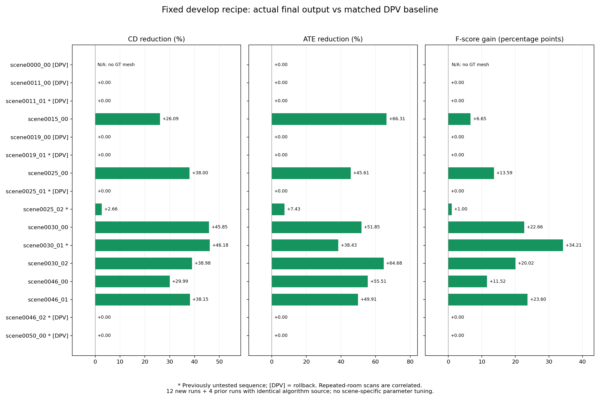

# develop 扩展场景验证报告

本轮固定 develop@fe7d5ac，新增完整运行 12 个 ScanNet 序列：5 个实际最终输出的 CD、ATE、F-score 全部改善，7 个保留原 DPV。7 个此前未测序列中仅 2 个获益，唯一新增物理房间 scene0050 未获得最终收益。因此有可复现的提升，但尚不能声称对新房间普遍有效。

扩展验证期间算法与参数固定，本文档提交不改变算法；未重跑或训练 DPV，使用冻结的相同已接纳 RGB-D 和缓存 DPV 连续轨迹。下述比较对象均为 DPV 基线与实际 committed 输出，不是只看 candidate。

累计实际最终结果的 CD 均值为 **45.84 cm**（15 个有 GT mesh 的序列，包含回滚）；8 个采用优化的子集均值为 **24.43 cm**，这只是分组诊断，不能代替整体结果。完整 16 序列的接受/回滚清单、轨迹与点云散列见 [产物索引](validation/depth_first_20260908/artifact_index.json)。

## 本次新增的 12 个完整运行

| 场景 | 是否此前未测该算法 | 最终结果 | CD 降低 | ATE RMSE 降低 | F-score 增加 |
|---|---|---|---:|---:|---:|
| scene0011_00 | 补齐正式运行 | 保留 DPV | 0.00% | 0.00% | +0.00 pp |
| scene0011_01 | 是 | 保留 DPV | 0.00% | 0.00% | +0.00 pp |
| scene0015_00 | 补齐正式运行 | 采用优化 | 26.09% | 66.31% | +6.65 pp |
| scene0019_00 | 补齐正式运行 | 保留 DPV | 0.00% | 0.00% | +0.00 pp |
| scene0019_01 | 是 | 保留 DPV | 0.00% | 0.00% | +0.00 pp |
| scene0025_00 | 补齐正式运行 | 采用优化 | 38.00% | 45.61% | +13.59 pp |
| scene0025_01 | 是 | 保留 DPV | 0.00% | 0.00% | +0.00 pp |
| scene0025_02 | 是 | 采用优化 | 2.66% | 7.43% | +1.00 pp |
| scene0030_01 | 是 | 采用优化 | 46.18% | 38.43% | +34.21 pp |
| scene0030_02 | 补齐正式运行 | 采用优化 | 38.98% | 64.68% | +20.02 pp |
| scene0046_02 | 是 | 保留 DPV | 0.00% | 0.00% | +0.00 pp |
| scene0050_00 | 是 | 保留 DPV | 0.00% | 0.00% | +0.00 pp |

三个分组的结果应分别解读：

| 范围 | 采用/序列数 | 平均 CD 降低 | 平均 ATE 降低 | 平均 F-score 增加 |
|---|---:|---:|---:|---:|
| 本次新运行 12 个 | 5/12 | 7.88% | 12.82% | 6.29 pp |
| 其中此前未测的 7 个 | 2/7 | 3.29% | 2.48% | 5.03 pp |
| 合计 16 个（含前次 4 个） | 8/16 | 11.90% | 17.29% | 8.88 pp |

平均值按序列等权计算，包含回滚序列的零变化；“降低”用基线宏平均与最终宏平均的差除以基线宏平均，并非逐场景百分比的简单平均。累计 16 个序列覆盖 8 个物理房间，CD/F-score 只有 15 个有 GT mesh；scene0000_00 的缺失指标不计入均值。此前四次公共运行的 329 个算法源文件与本轮逐一同散列，只复用结果，没有重复宣称它们是本轮新运行。
按物理房间先汇总再等权，累计 CD 降低 10.06%，ATE 降低 13.67%，F-score 增加 6.98 pp。即使这样汇总，也不能把这批便利选取的数据视为独立随机采样或统计显著性证明。

## 不能忽略的回退与未解决项

1. scene0025_02 虽然 CD、ATE、F-score 改善，但逐帧旋转 RPE RMSE 从 0.179214759° 增至 0.179465847°；Recall 从 29.5242% 降至 28.2325%，下降 1.2917 pp。不能称为每个指标都提升。
2. 新物理房间 scene0050_00 最终保留原结果。其候选 CD 降低 13.51%、ATE 降低 18.81%，但 F-score 下降约 1.47 pp，而且没有通过无 GT 检查；不采用该候选有实际依据。
3. scene0019_01、scene0025_01、scene0046_02 的候选三项主要指标都改善，仍被拒绝。0019_01 同时有层冲突和深度改善不足；0025_01 通过全图安全检查，但只有 4/6 条回环达到额外视角 20% 损失降低，未满足 75% 比例；0046_02 通过相对深度检查，但无法匹配到满足要求的同一物理平面。这里存在全局指标和局部检查之间的分歧，不能仅凭 GT 好看就放宽检查。
4. 7 个此前未测序列包括已有房间的其他扫描，只有 scene0050 是新房间。两个新序列收益为 scene0025_02 和 scene0030_01；本批没有证明新的物理房间也能稳定提高。

这些结果支持保留当前开发实验配置及回滚机制，进一步排查的重点是“哪些几何检查确实捕捉到局部损伤，哪些检查因为匹配不稳定而拒绝了有用修正”。本轮没有据此调参或重新挑选结果。

## 完整性与产物

12/12 正式运行完成，共 22626 个已接纳帧。封存并复核 45300 个输入文件，329 个算法源文件。每个结果检查完整有效轨迹、相同帧身份、完整 TSDF 融合收据及最终点云 SHA-256；七个回滚轨迹均与各自原 DPV 字节相同。第一次预检误把 GT 位姿目录指到网格目录，在推理前失败；路径修正后的正式批次全部成功，失败日志保留。
所有推理输出先封存再进行 GT 评估；用户原 CD 脚本 SHA-256 为 8cbec6c5273a9a2d9f5d169e01b7433a36bcfc6c822ca4d63f7984eefdcd5154，使用 5 cm 下采样与非平方双向均值之和。F-score 使用相同已接纳帧构成的共同观测区域及 5 cm 阈值；GT 不参与推理或采用决策。
下载产物 664 个文件、36 个 PLY、680892805 字节，已逐一校验。环境为 i9-13900HX、RTX 4060 Laptop、Python 3.10.20 / Open3D 0.17.0，两个公共运行并发；墙钟时间不用于声称相对旧算法的独立加速。

[逐序列和逐方法完整指标 CSV](validation/depth_first_20260908/metrics.csv) · [结构化分析](validation/depth_first_20260908/analysis.json) · [输入/最终输出审计](validation/depth_first_20260908/final_integrity.json) · [下载校验](validation/depth_first_20260908/artifact_index.json)

## 复现入口与证据边界

运行方式见 [pipeline 指南](depth_first_pipeline_zh.md)，配置为 `configs/pose/unified_backend_depth_first.yaml`。验证算法提交为 `fe7d5ac16ec96751aa7117d94e48f57f5098e95f`。本次 Git 提交包含报告、完整指标、环境记录、审计收据和对比图。大型 RGB-D、点云与轨迹由外层实验产物目录管理，产物索引给出相对位置和 SHA-256；索引中的 `comparisons/` 位于外层工作区，不是本 Git 仓库目录。
