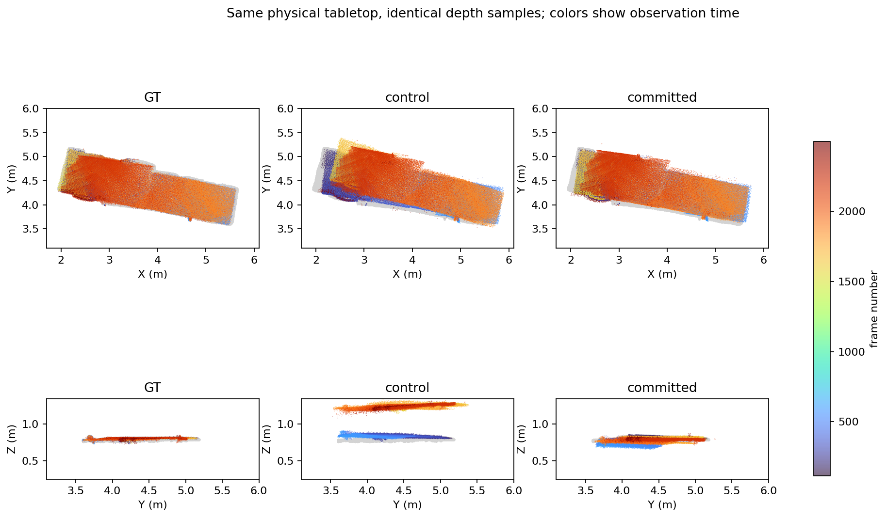
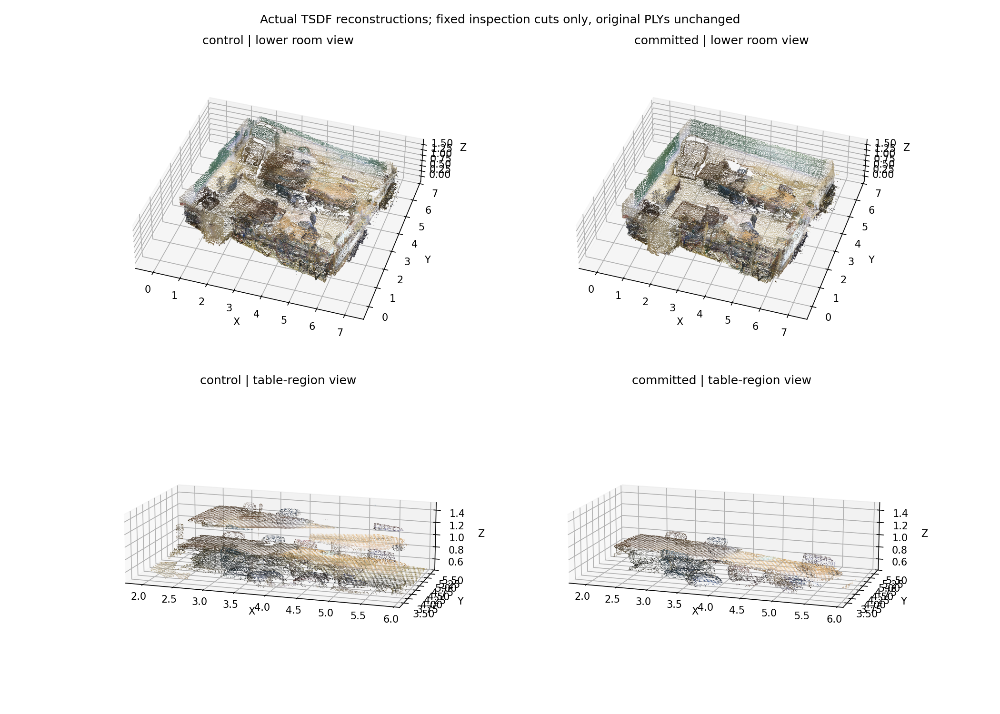

# Depth-first RGB-D 轨迹优化

最新结果见 [16 序列扩展验证](depth_first_expanded_validation_zh.md)：累计 8 个采用优化、8 个回滚；可评估的 15 个实际最终输出 CD 均值 45.84 cm。下文保留最初六场景候选实验、四场景正式验证及算法说明，不应把这些较小范围结果当作全部最新结果。

本配置用于 develop 的实验性完整轨迹优化。它保留 DPV 连续前端，增加不依赖 PnP 成功的深度回环路径，再对全部已接纳帧重新进行 TSDF 融合。没有引入 ColorPCR 或 PointDSC，也不读取 GT 来生成或选择轨迹。它不是重训练后的 SLAM 前端，也尚未取得 main 的生产资格。

## 为什么旧实验只有一个场景出现改善

旧补救模块接在 `PnP 初检通过 → 几何配准成功 → 最终视觉一致性失败` 后面。在九个场景的调用审计中，只有 scene0030_00 调用过一次新增深度验证，其余八个均为零。新增四个场景的 118 个提议中，109 个被前置 PnP 拒绝，7 个几何求解失败，2 个已经被旧路径接收。因此，旧结果不能证明方法只适用于一个场景；它没有充分执行新增方法。

原 scene0030_00 的改善还属于直接注入一条几何回环的诊断，严格的末端深度验证并未放行它。重新运行诊断得到字节相同的 PLY，排除了该次正例不可复现，但不能把诊断当作正式输出。

## 新路径

1. 保留 Hybrid36 提议和原视觉/几何验证；未被原路径接收的提议另行尝试独立 FPFH 几何配准和由 DPV 相对位姿初始化的双向多尺度 ICP。
2. 局部拟合使用锚点附近 -8、0、+8 帧；新增回环用 -6、-2、+2、+6 帧检查双向深度重投影。检查覆盖率、残差、损失改善、正反向一致性、退化平面和多解冲突。
3. 保留 plain local ICP 约束。新增回环经过已有实测边组成的三角一致性检查及每锚点最多四条回环的限制，再进入 Huber 优化与平滑修正传播。没有可用实测三角时，不能声称该回环已得到三角验证。
4. 保持逐帧相邻修正上限 5 cm / 2°；本配置的绝对修正上限为 75 cm / 15°。这是显式配置变化，旧的 25 cm / 5° 实验也完整保留。
5. 优化完成后，在另外 -14、-10、+10、+14 帧检查实际输出轨迹。这些图像未用于本回环拟合和接收。全图占用、尺寸、匹配平面厚度及倾斜、层冲突等安全门槛继续生效。

新采用条件区分“比原轨迹改善”与“达到绝对 5 cm 精度”。至少 75% 的新增回环必须在额外视角上降低平均截断深度损失至少 20%，每条回环平均损失不得恶化超过 5%，至少 75% 的投影方向保留足够支持。绝对精度审计仍单独记录；相对改善通过不代表绝对精度通过。旧的“RANSAC 平面内点厚度还必须改善 10%”仅作为历史改善指标保留，新配置用额外视角的相对改善决定是否采用。

额外帧避免重复使用拟合图像，但仍共享相机和局部 DPV 误差，不能视为完全独立传感器。有限场景实验也不能保证任意新场景都改善。

## 运行与识别最终结果

在具备项目依赖、Open3D、SciPy、OpenCV 和原 CLIP 缓存的环境中：

```bash
PYTHONPATH=src python -m pose_pipeline run-unified \
  --manifest /path/to/frontend/tracked_manifest.json \
  --trajectory /path/to/baseline/trajectory.json \
  --config configs/pose/unified_backend_depth_first.yaml \
  --clip-download-root /path/to/clip-cache \
  --output /path/to/new-output
```

输出目录应为新目录。CLI 要求显式指定配置；旧配置不会自动启用新算法。应直接使用公共入口重跑新配置，旧的单因素 replay 工具不支持重放这组额外约束。

- `unified_result.json.accepted`：本次开发配置是否采用优化轨迹。
- `unified_result.json.final_cloud` 和 `committed_trajectory`：实际最终点云和轨迹，并附 SHA-256。不要仅凭文件夹名判断。
- `trajectory.proposed.json`：候选轨迹，拒绝时仍可能存在。
- `depth_first_evidence.json`：新增路径的提议、拒绝、接收和约束证据；原 `loop_evidence.json` 仅描述旧视觉/几何路径。
- `postfit_depth_audit.json`：额外视角的严格绝对精度审计；相对改善决定位于最终结果的 `precommit_geometry.postfit_relative_improvement`。
- `precommit_refusion/*/refusion_result.json`：完整融合帧数、输入与点云绑定。

采用时输出仍标记 `development_only=true, promotion_eligible=false`，表示允许 develop 实验使用，不表示 main 生产资格。拒绝时保留字节相同的原 DPV 轨迹。

## 首轮六场景候选结果

以下比较对象是原 develop 的 plain-local-ICP **候选**，不是原先回滚后的 DPV 最终结果。两臂使用相同冻结 RGB-D、DPV 轨迹及完整已接纳帧；新候选统一采用 75 cm / 15° 配置。

| 场景 | 新回环 | 旧候选 CD (cm) | 新候选 CD (cm) | CD 降低 | ATE 降低 | F-score 增加 (pp) |
|---|---:|---:|---:|---:|---:|---:|
| scene0030_00 | 7 | 33.1967 | 21.3312 | 35.74% | 39.27% | 19.7159 |
| scene0030_02 | 4 | 18.1673 | 13.0771 | 28.02% | 43.06% | 11.5312 |
| scene0011_00 | 1 | 60.3563 | 48.5399 | 19.58% | 24.40% | 4.1850 |
| scene0015_00 | 4 | 58.8954 | 49.4014 | 16.12% | 53.16% | 3.6983 |
| scene0019_00 | 0 | 68.8195 | 68.8195 | 0.00% | 0.00% | 0.0000 |
| scene0025_00 | 1 | 35.2559 | 22.5868 | 35.93% | 47.36% | 11.8689 |

这六场景的首轮实验强制保留 DPV 最终输出，以上只证明候选收益。scene0011_00 未通过全图匹配平面安全检查，不能因其 GT 指标改善就放行。所有非空场景的严格额外视角绝对精度门槛仍未通过。反向修正负例六组全部未通过新的相对深度采用条件。

不是每个指标都改善：scene0030_00 旋转 RPE 从约 0.1907808° 到 0.1907996°，scene0011_00 平移 RPE 从约 0.012170329 m 到 0.012171222 m。较小的 25 cm 上限在部分场景出现 F-score 回退，不能与本配置的结果混用。

CD 使用用户原脚本的非平方双向最近邻均值之和，5 cm 下采样，完整 GT mesh 顶点和首个有限 GT 位姿刚性对齐，无 ICP 对齐；脚本 SHA-256 为 `8cbec6c5273a9a2d9f5d169e01b7433a36bcfc6c822ca4d63f7984eefdcd5154`。F-score 使用共同观测参考表面和 5 cm 阈值；ATE 使用原轨迹评估器。GT 仅在推理封存后评估，不反馈到回环、权重或单场景参数选择。

## 正式公共入口验证

相对改善策略在重跑 scene0030_00 和三个此前未测试新方法的场景前冻结，没有按新场景 GT 调参数。四个公共入口完整运行采用同一 YAML；推理封存后单独运行评估。下表比较**原最终 DPV 输出 → 新配置实际最终输出**：

| 场景 | 最终决策 | CD (cm) | CD 降低 | ATE RMSE (m) | ATE 降低 | F-score (%) |
|---|---|---:|---:|---:|---:|---:|
| scene0030_00 | 采用新轨迹 | 39.3933 → 21.3312 | 45.85% | 0.56082 → 0.27004 | 51.85% | 20.9202 → 43.5754 |
| scene0046_00 | 采用新轨迹 | 37.7068 → 26.3987 | 29.99% | 0.52445 → 0.23334 | 55.51% | 23.8427 → 35.3666 |
| scene0046_01 | 采用新轨迹 | 26.7069 → 16.5175 | 38.15% | 0.32121 → 0.16091 | 49.91% | 33.6695 → 57.2724 |
| scene0000_00 | 保留 DPV | 缺 GT mesh，未计算 | — | 1.05488 → 1.05488 | 0% | 缺 GT mesh，未计算 |

相对旧 develop **候选**，0030_00、0046_00、0046_01 的 CD 分别降低 35.74%、7.94%、26.07%，ATE 分别降低 39.27%、34.41%、33.76%，F-score 分别增加 19.72、2.38、18.52 个百分点。不要将这个比较分母与上表的最终 DPV 分母混淆。三个实际采用结果的 ATE、旋转绝对误差 RMSE、两项逐帧 RPE RMSE、CD 和 F-score 都优于原最终 DPV；各分位数/最大误差并非一律更好。完整指标见 [结构化验证记录](depth_first_validation_20260908.json)。

0000_00 的候选 ATE 为 0.63402 m，但匹配平面厚度增加约 14.34%，超过保留的 10% 安全上限；额外视角的深度损失也没有改善，部分回环恶化超过 5%。因此保持回滚，不因事后 ATE 好看而接收。

完整融合帧数分别为 2271、2383、2338、5429，全部保持原 manifest 的接纳序列。0046_00 有一帧 GT 无效，轨迹评估覆盖 2382/2383 帧；输出和融合仍包括全部 2383 帧。0000_00 的缺失 CD/F 不是零误差。

测试为 73 passed + 48 subtests；四次公共入口均完成，源文件和推理产物在 GT 评估前后散列一致。六组反向修正负例均拒绝，原控制及较小修正臂也未误判为通过相对改善。三个正式采用场景仍未通过严格绝对深度精度审计，开发采用只声称相对改善。

环境为原远程 Linux 主机的 Python 3.10.20、NumPy 1.24.1、Open3D 0.17；新几何路径在 CPU 上执行，已有 CLIP 使用 RTX 4060 Laptop。四次公共命令墙钟分别约 169、140、138、461 秒，包含缓存前端之后的后端和完整 refusion，不包含重跑 DPV；任务有并发，因此不能据此声称相对旧配置的独立速度提升。

## scene0030_00 同一物理桌面

对正式 `committed_trajectory` 重新执行原同一物理桌面追踪：156 个采样帧、581275 个深度点，早晚桌面高度误差差从 41.03 cm 缩小到绝对 1.24 cm。它是同一桌面在不同时间观测的高度一致性，不是全场景精度或单个表面厚度。





实际融合 PLY 中原先明显相隔约 40 cm 的两层桌面已合并为同一桌面带，仍有局部厚度、形变和其他区域误差。显示使用统一刚性对齐和固定截面，未修改 PLY、移动或删除桌面点。GT object 47 只用于事后关联同一张桌子的深度样本，绝不参与优化；场景中的其他真实桌子保留。

正式最终点云 SHA-256：`c8d6283f552acd70753c7dd398b5149298ae749f7c1a6425570ea7740b32d600`。最终轨迹 SHA-256：`ecf689e8768ba1911717e893ddf57ec21b5cc94da1e1b13b83c15682b3b17276`。正式结果和首轮 depth75 轨迹存在约 1.6e-8 的矩阵数值差异，不能声称两个 PLY 字节相同。

首轮源码提交 `1ff0b80`，正式公共入口与相对改善策略提交 `5b6bdd9`。完整证据位于外层工作区 `comparisons/depth_loop_routing_audit_20260907`、`comparisons/depth_first_pipeline_20260908`、`comparisons/depth_first_postfit_audit_20260908` 和 `comparisons/depth_first_public_v2_20260908`；后者含 `evaluation/summary.json`、`pre_gt_sha256.json`、`final_integrity.json`、`full_download_integrity.json`、负例和桌面审计。已复核 329 个冻结源文件、237 个推理文件，正式产物下载 296 个文件（11 个 PLY，共 265275195 字节）并逐一校验 SHA-256。数据集、模型缓存和大型 PLY 不上传 Git；仓库随附紧凑验证记录与上述展示图。
