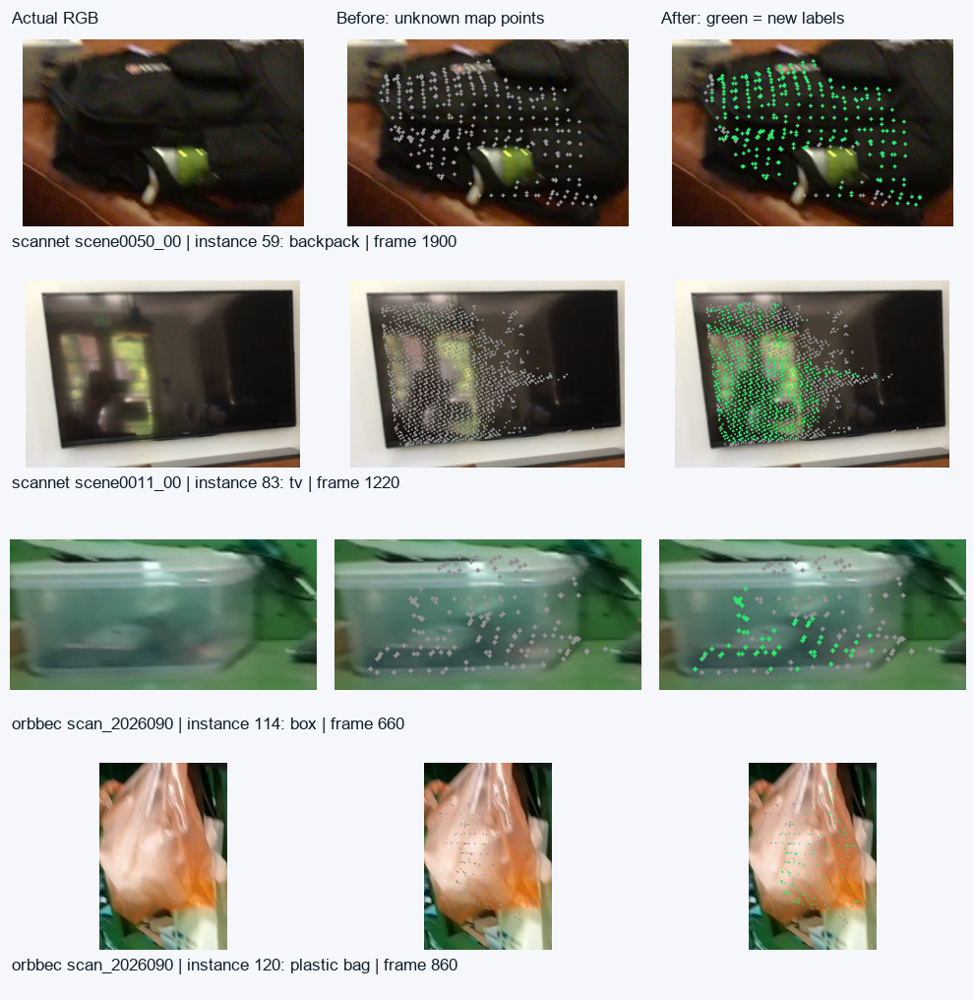

# 多视角未知点优化（2026-09-16 接入）

新增 `refine-semantic` 独立入口：固定已重建地图/估计轨迹 → 按物体选优质视角 → Qwen3-VL-2B NF4 → SAM3 独立文本掩码 → 深度对应 → 只填有多帧直接支持的未知点。默认不覆盖已知类别、不扩张实例、不改几何。`--fragments` 是经过 Orbbec 开发场景检查的可选三视角策略。

原 `run-sam3`、`enhance-semantic`、模型/API 注册表及 `--schedule serial|parallel` 保持可用；新入口的 GPU 模型按阶段顺序加载，不宣称新建图并行能力。stride5 仍是原语义流程默认，未合入退步的运动选帧或5cm扩张。

## 实测收益及范围

| 场景 | 原全GT正确标注率 | 优质视角＋未知点填充 | 类别正确实例IoU50 |
|---|---:|---:|---:|
| ScanNet0030 | 59.41% | 59.41% | 20/82 → 20/82 |
| ScanNet0050 | 33.20% | 33.40% | 2/29 → 2/29 |
| ScanNet0011 | 40.70% | 41.26% | 5/27 → 5/27 |
| 3RScan 00d42bed | 0.016% | 0.016% | 0/30 → 0/30 |

分母是全部已标注GT网格顶点，固定首帧坐标对齐、5cm表面对应；unknown与缺几何算错误。不是官方AP/mIoU，也不是旧27实例子集或18裁剪命名分数。新增1497个GT对应顶点正确、17个错误，原正确标签没有被改坏；实例完整性没有显著提升。

ScanNet0050新增背包293个原地图点，0011新增电视1313点。启用 `--fragments` 后，Orbbec收纳盒新增64点、塑料袋180点；没有完整GT，只完成真实RGB对照及多帧投影核验。该策略在观察主实验后提出，属于开发实验，不能声称独立泛化验证。



灰点为原未知实例，绿点为新增标签；只填满足证据的部分。几何、已有实例ID与原confidence保持不变，另输出 `naming_support`，不把原confidence冒充新语义的校准置信度。

3RScan443来自最终 `1cf90f7` / `47b9691` 的已知几何失败样本（ATE5.532m），语义后处理不能修复折叠。另用同版本较可用的3RScan09582214完整187帧做等预算对照：运动采样虽然提高覆盖，已标点准确率由55.56%降到49.98%，未采用。其余五场中央120帧各25帧预算，也没有普遍优于固定stride5。

本批真实推理1491次Qwen命名、587次SAM3文本查询；命名含加载146.22秒，SAM3确认141.89秒，主写回15.04秒。固定几何实验不含SLAM，不能据此报告完整pipeline FPS。[结构化结果](REPORT_DATA.json) / [逐场逐策略GT结果](MAP_EVALUATION.json) / [碎片策略GT结果](FRAGMENT_EVALUATION.json)。

## 新场景完整运行

在可访问RGB-D、权重和各Python环境的主机上创建一个**新目录**：

```text
my-refinement/
  INPUT_PLAN.json
  runtime.json
  inputs/scannet/scene0050_00/
    INPUT.json
    manifest.json
    trajectory.json
    target.npz
    base.npz
    classes.json
```

- `INPUT_PLAN.json`：`{"scenes":["scannet/scene0050_00"]}`。也支持多个场景，名称不能含 `..`。
- `runtime.json`：复制仓库 `configs/semantic_runtime.example.json`，填写当前主机的 `cpu_python`、`vlm_python`、`sam3_python`、SAM3源码/权重/hash以及 `models.qwen3vl_2b_nf4.weights`。不包含token明文。
- `manifest.json`：已有 `rgbd_sequence_manifest.v1`，路径指向真实RGB-D；`trajectory.json`：对应 `pose_trajectory.v1` 估计轨迹，不用GT轨迹。
- `target.npz`：`xyz` 为有限值 `N×3`，必须与base逐点顺序/坐标一致。
- `base.npz`：`semantic`、`instance`、`confidence` 均长N。类别/实例0表示未知，已有T1/P2未知实例可作为种子。
- `classes.json`：类别ID字符串到名字，必须含 `"0":"unknown"`；当前输入预期沿用项目分类编号 floor=10 / wall=19。
- `INPUT.json`：显式登记RGB-D注册方式，见下方。输出源说明可加入这个文件。

已经与深度相机注册的RGB（包括对应内参的已旋转3RScan/Orbbec）使用：

```json
{"rgb_registration":"already_registered"}
```

ScanNet原生未注册RGB使用原 `.sens` JPEG及标定映射：

```json
{"rgb_registration":"scannet_sens","sens_path":"/absolute/data/scene0050_00/scene0050_00.sens"}
```

后一模式只支持验证过的相同单位外参；非单位RGB-D外参会拒绝运行，需要另外实现深度相关的注册。它跳过GT pose和IMU记录，不解码用于推理。三场首帧已逐像素复现旧注册RGB。不能用简单缩放代替标定映射，也不能据此认为所有旧结果都错位。

```bash
PYTHONPATH=src python -m pose_pipeline.semantic_runtime refine-semantic \
  --workspace /absolute/path/my-refinement --stage all

# 可选：在严格未知点填充之外加入三视角碎片策略。
PYTHONPATH=src python -m pose_pipeline.semantic_runtime refine-semantic \
  --workspace /absolute/path/a-new-refinement --stage all --fragments
```

`all` 按所填解释器依次执行 `prepare → name → decide → ground → apply`。不会覆盖已有阶段目录；中断后可指定未完成的 `--stage`，失败半成品须保留并使用新的工作目录。命名和SAM3阶段是真实GPU推理，要求CUDA，不回退假输出。

仅重算已有完整证据的最后一步：

```bash
PYTHONPATH=src python -m pose_pipeline.semantic_runtime refine-semantic \
  --workspace /absolute/path/completed-evidence --stage apply --fragments
```

此命令是**CPU证据重放**，不能计为新的模型/SLAM实验。集成验收就是以该方式确认新代码在五场数据上重现原候选。

## 参数、输出与限制

| 环节 | 固定值 |
|---|---|
| 选图候选 | 每20原始帧及末帧；不是改变原SAM3 stride5 |
| 实例/可见性 | 非墙地面≥50点；可见≥30点且≥15%；bbox边≥10像素 |
| 多视角 | 最多3命名视角＋1独立验证视角；帧间≥20，位移≥0.12m或光轴差≥8° |
| 图像排序 | 可见比例×面积平方根×清晰度；外扩15%保留上下文 |
| 命名 | Qwen3-VL-2B NF4，原注册表3136–150528pixels、24tokens、贪心、seed42 |
| 常规写入 | SAM3 score≥0.5、coverage≥0.5、purity≥0.75、IoU≥0.4、至少2帧通过；每点直接支持≥2帧，至少50点 |
| 可选碎片 | score≥0.6、coverage≥0.8、purity≥0.5、IoU≥0.5；至少3帧，每点3帧直接支持，至少50点 |

主要结果在 `refined/<scene>/`，启用碎片策略时为 `refined-fragments/<scene>/`：`semantic_labeled.ply`、`map_labels.npz`、`classes.json`、`objects.json`、`RESULT.json`；上层有结果汇总和预测SHA锁。保留 `objects/` 视角/裁剪、`naming/` 原始回答及细类、`grounding/` 实际掩码证据。

名称统一沿用本轮冻结规则，仅在本入口内部形成共识；不会修改其他模型命名默认。细类投影仍存在 coffee table / coffee mug / garage door / blinds 等词表风险，必须查看原始名；不能据“同名数量增加”宣称准确率提升。已知类别的container/door等部件与整体冲突不会强行改写。

本入口使用**已有实例**，没有实现开放类别新物体种子的通用生成器，也不会改善已有几何。当前采用范围为这些开发场景的局部收益，不能称全数据集通过。完整原实验在本地 `comparisons/semantic_pipeline_round2_20260915_v1/` 和ssh33同名目录封存；大型RGB-D、权重和PLY不上传Git。
