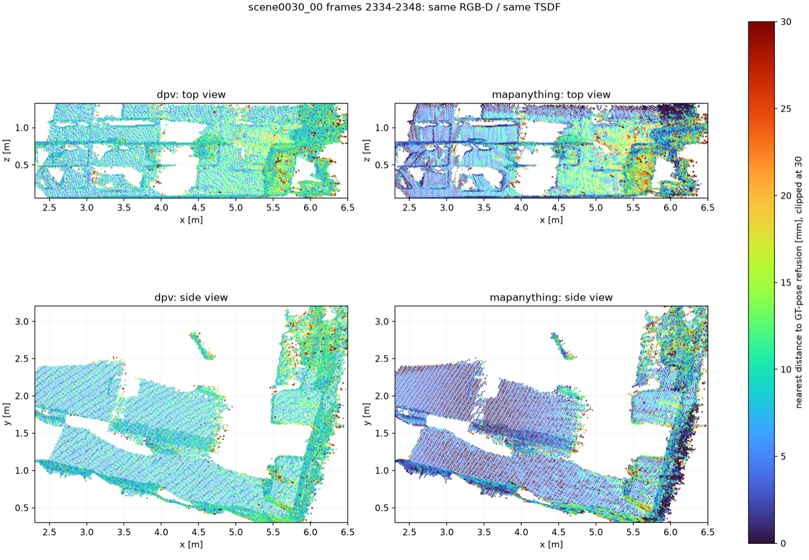
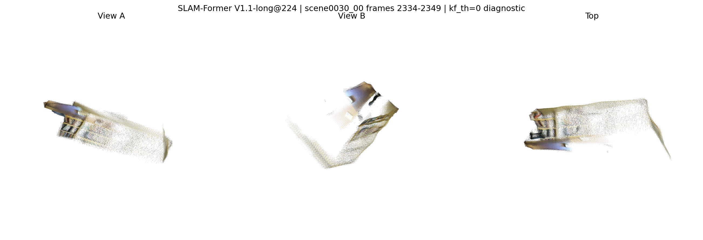

# Jetson Orin 30 W motion-window accuracy check

This development-only check uses ScanNet `scene0030_00` frames `2334..2349`.
The interval was selected with evaluation-only GT because it contains useful
motion: `0.3879 m` and `18.444 deg` between its endpoints, with maximum
single-step motion of `0.0482 m / 3.025 deg`. The model manifest contains only
RGB, raw depth, intrinsics, timestamps and depth scale. GT was never present in
any inference input root and was exposed only after all model outputs existed.

The no-GT manifest payload SHA-256 is
`282989bbbd3fa91e00aac2c8ac884a96e711400288a9bd78204fda6b5c245b7d`.
The selection receipt is retained separately so this development window cannot
be mistaken for a held-out result.

## Results

| Candidate | Configuration | Coverage | metric SE(3) ATE RMSE | median RPE translation | median RPE rotation | residual Sim(3) scale |
| --- | --- | ---: | ---: | ---: | ---: | ---: |
| MapAnything | independent RGB + intrinsics + metric depth, 16-frame window | 16/16 | **0.006622 m** | **0.005348 m** | 0.1521 deg | 0.9761 |
| ABot-Recon | official no-loop, SDPA, RGB-D scale recovery | 16/16 | 0.009195 m | 0.005442 m | **0.1315 deg** | 1.0193 |
| SLAM-Former | V1.1-long@224, diagnostic `kf_th=0` | 16/16 anchors | 0.008859 m | 0.009338 m | 0.1944 deg | 1.0195 |
| SLAM-Former | V1.1-long@224, official default `kf_th=0.1` | 1/16 selected | no trajectory | no trajectory | no trajectory | unavailable |

The ATE values use a rigid SE(3) alignment with scale fixed to one. Sim(3) is
reported only as a diagnostic and is not used for the metric conclusion.

MapAnything is the strongest result on this window: it has the lowest ATE and
translation RPE while consuming the sensor's metric depth directly. ABot-Recon
is close and has the lowest median rotational RPE. SLAM-Former with every frame
forced to be a keyframe is a useful research reference, but it is not its
official online/default behavior and has the weakest translation RPE here.

## Matched DPV baseline and RGB-D refusion

The original full `scene0030_00` DPV worker responses were recovered from the
frozen August 31 run. DPV returned 15 valid poses for this 16-frame interval.
The source `responses.jsonl` SHA-256 is
`aaa1fc0b11f3db2e765c79e48a33ae132b43d29bf95d6034bb59a78fda31fe27`.
Frame `2349` was rejected by the worker's continuity gate
(`0.050 m / 3.07 deg > 0.040 m / 3.50 deg`), so no 16-frame DPV refusion was
fabricated. Its coverage is `93.75%`, which independently fails the proposed
at-most-one-percent coverage-loss promotion gate.

All four methods were nevertheless compared on the exact common frames
`2334..2348`, using the same RGB, raw sensor depth, intrinsics and Open3D TSDF
parameters (`2 cm` voxel, `8 cm` truncation, `4.5 m` depth limit):

| Arm | metric SE(3) ATE RMSE | median RPE translation | median RPE rotation |
| --- | ---: | ---: | ---: |
| DPV-SLAM | 0.006096 m | **0.003271 m** | **0.1067 deg** |
| MapAnything independent | **0.006009 m** | 0.005158 m | 0.1457 deg |
| ABot-Recon no-loop | 0.009377 m | 0.005362 m | 0.1233 deg |
| SLAM-Former `kf_th=0` diagnostic | 0.008820 m | 0.008964 m | 0.2078 deg |

Against the evaluation-only GT-pose refusion of those same 15 RGB-D frames,
MapAnything reduced symmetric mean surface distance from `10.504 mm` to
`7.802 mm` (25.7%) and RMSE from `11.974 mm` to `10.790 mm` (9.9%). This was
not a complete geometry win: 3 cm F-score changed from `0.98947` to `0.98764`,
near-parallel layer conflict worsened by 1.7%, and dominant-plane thickness
worsened by 4.0%. ABot and the SLAM-Former diagnostic were worse than DPV in
both refusion distance and structural metrics.

The darker MapAnything regions explain its lower mean error, while the localized
yellow/red regions explain why its tail and structure gates do not improve.

## DPV-conditioned MapAnything test

An additional create-only 8-frame A/B (`2334..2341`) supplied valid DPV
`T_world_camera` poses to the official MapAnything pose-conditioning input.
Relative to DPV, the conditioned revision reduced ATE by 17.2%, translation
RPE by 15.8%, and rotation RPE by 17.6%. The independent 8-frame run reduced
ATE by 18.8% but worsened rotation RPE by 15.1%, so conditioning produced the
more balanced trajectory.

That pose improvement did not propagate into a material TSDF improvement.
Against the same GT-pose refusion, conditioned MapAnything reduced mean surface
distance by only 0.02% and RMSE by 0.37%, and raised 3 cm F-score by only 0.01%,
while layer conflict worsened by 0.74%. Inference took `8.227 s` with 8.32 GB
peak CUDA allocation. This arm remains a background-refinement experiment, not
a main-chain replacement.

## Runtime and scale evidence

- MapAnything: 16.242 s model inference (`0.985` input frames/s), 9.01 GB peak
  CUDA allocated and 9.64 GB reserved. Its model output remained metric; the
  post-hoc Sim(3) residual scale was `0.9761`.
- ABot-Recon: 25.803 s process wall time and maximum tegrastats system RAM of
  10,593 MB. Paired sensor depth estimated `2.685276 m/model-unit`; post-hoc
  residual Sim(3) scale was `1.0193`.
- SLAM-Former diagnostic: 17.667 s official internal total, 51.132 s process
  wall, 0.906 input frames/s and maximum tegrastats system RAM of 14,915 MB.
  Paired sensor depth estimated `2.121441 m/model-unit` with 5th-to-95th
  relative spread `0.05295`.

This remains an Orin compatibility environment: SLAM-Former used NVIDIA
Jetson Torch 2.5/CUDA 12.6 and NumPy 1.26.3, and its CUDA RoPE2D extension was
unavailable. Those differences remain part of the evidence.

## SLAM-Former default failure

At the official default `kf_th=0.1`, the per-frame keyframe scores rose only to
`0.0491`. The model therefore retained one keyframe, then failed closed during
termination because its backend map was `None`. No trajectory or identity
fallback was emitted. A separate create-only run set `kf_th=0` and retained all
16 real observations. That run produced 16 finite TUM rows and a
511,795-vertex PLY, but it is labelled diagnostic throughout.

## Decision boundary

This run establishes that MapAnything and ABot-Recon are executable on a
meaningful motion window and that SLAM-Former's default keyframe policy is not
viable for these dense ScanNet inputs. It does **not** authorize replacing DPV:
the matched DPV response was recovered, all available common frames were
refused, and no candidate produced the required simultaneous pose, coverage and
final-geometry improvement. This is also only one development window.

The current integration recommendation is therefore:

1. keep DPV as the continuous metric frontend;
2. keep MapAnything as the first non-blocking 8/16-frame local-refinement
   candidate, preferably DPV-conditioned, but require longer-window refusion
   gains before promotion;
3. keep ABot-Recon no-loop as the continuous-front-end challenger;
4. use SLAM-Former only as an opt-in anchor/backend experiment until its
   keyframe selection and complete-trajectory propagation are validated.

Compact raw evidence is under `orin_30w_motion16_evidence/`. The authoritative
remote create-only root remains
`/home/ai3d/Documents/sgf_sga_model_validation_20260902`. Multi-GB weights and
temporary dependencies were deleted from `/dev/shm` after inference; the
persistent validation root is about 1.6 GB and `/` still has about 2.0 GB free.
